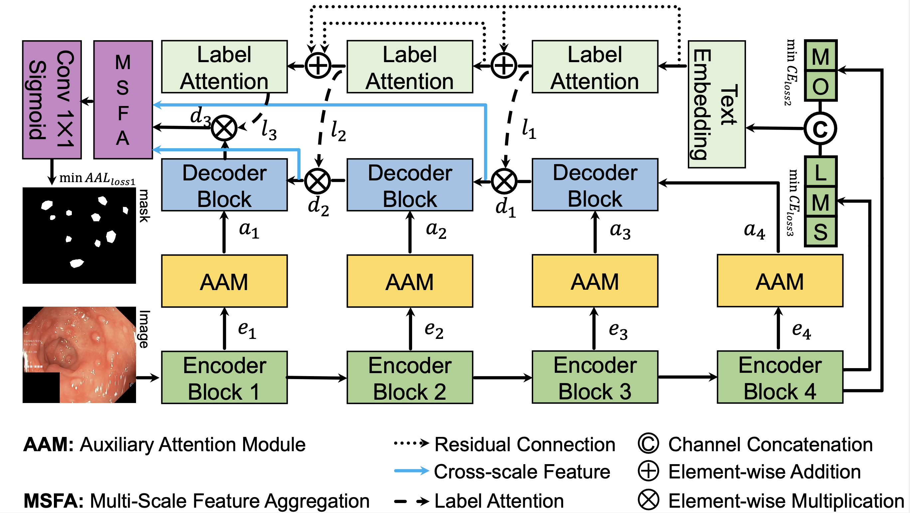

# DoubleAANet: Enhancing Polyp Segmentation with Auxiliary Attention and Area Adaptive

## 1. Abstract

One of the most leading causes of death worldwide is Colorectal cancer(CRC).
Polyp segmentation is the most important detected measure for preventing CRC.
However, there is still a missing rate for diminutive polyps and multiple ones.
In order to solve the phenomenon, we proposed to introduce auxiliary attention module(AAM) that can enhance the learning of features related to multiple and diminutive polyps by focusing more on the local and detailed information. 
We first utilized channel attention module, spatial attention module and feature enhancement module to learn global and local feature in a parallel manner.
Meanwhile, we design to decrease missed rate of multiple and diminutive polyps by implementing an area adaptive loss(AAL).
AAL automatically adapts the weight according to the area and the number of polyps, which increases weight of small and many samples.
Our proposed novel AAM and AAL concentrates on training with hard examples and localized information.
To evaluate the effectiveness and generalization ability of our proposed model, We utilize three different datasets of variable sizes and a cross dataset.

## 2. Architecture

## 3. Implementation
The proposed architecture is implemented using the PyTorch framework (1.9.0+cu111) with a single GeForce RTX 3090 GPU of 24 GB memory. 

### Dataset
We have used the following datasets:
- [Kvasir-SEG](https://datasets.simula.no/downloads/kvasir-seg.zip)
- [CVC-ClinicDB](https://www.dropbox.com/s/p5qe9eotetjnbmq/CVC-ClinicDB.rar?dl=0)
- [Kvasir-Sessile](https://datasets.simula.no/downloads/kvasir-sessile.zip)

All the dataset follows an 80:10:10 split for training, validation and testing, except for the Kvasir-SEG, where the dataset is split into training and testing. 

## 4. License
The source code is free for research and education use only. Any comercial use should receive a formal permission from the first author.

## 5. Contact
Please contact feixiangdu2017@gmail.com for any further questions. 
